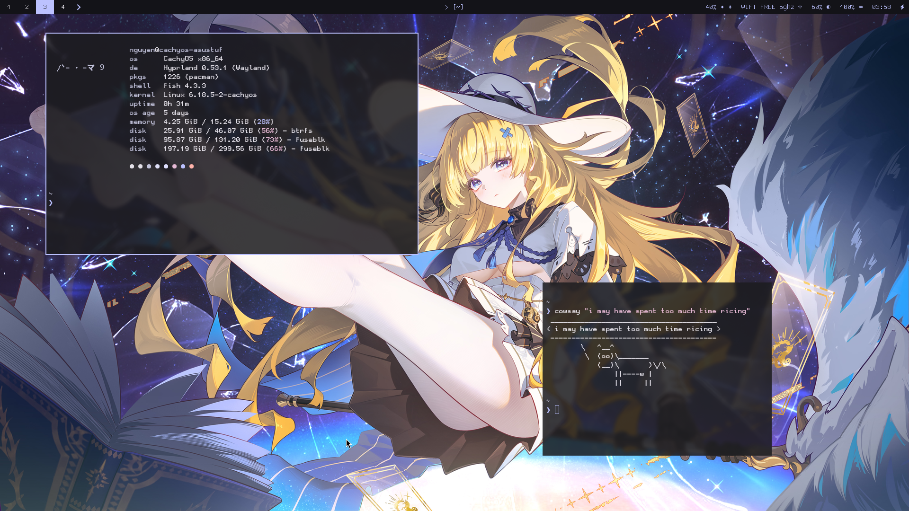

## Dotty Dots

My personal CachyOS (Arch btw) Linux configurations on Hyprland (Wayland).

### Preview


### Packages

| Component | Application |
|-----------|-------------|
| **Compositor** | [hyprland](https://hyprland.org/) |
| **Terminal** | [kitty](https://sw.kovidgoyal.net/kitty/) |
| **Shell** | [fish](https://fishshell.com/) |
| **Bar** | [waybar](https://github.com/Alexays/Waybar) |
| **Launcher** | [fuzzel](https://codeberg.org/dnkl/fuzzel) & [Rofi](https://github.com/davatorium/rofi) (Wallpaper Selector) |
| **Notifications** | [mako](https://github.com/emersion/mako) |
| **Theming** | [matugen](https://github.com/InioX/matugen) |
| **Fetch** | [fastfetch](https://github.com/fastfetch-cli/fastfetch) |

### Dependencies

```bash
paru -S hyprland kitty fish waybar fuzzel rofi mako fastfetch imagemagick playerctl brightnessctl matugen-bin


